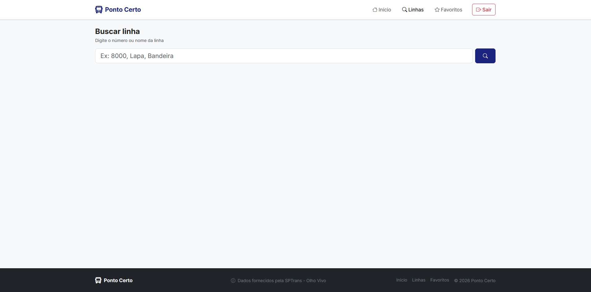
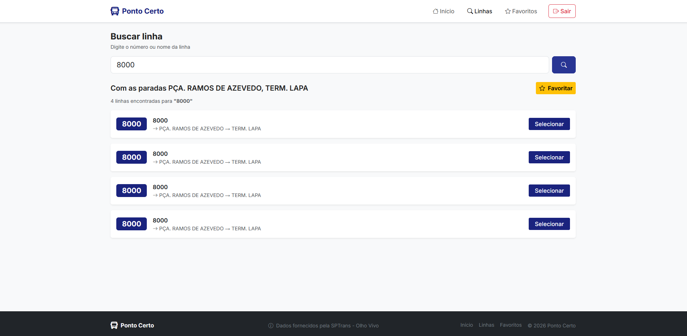
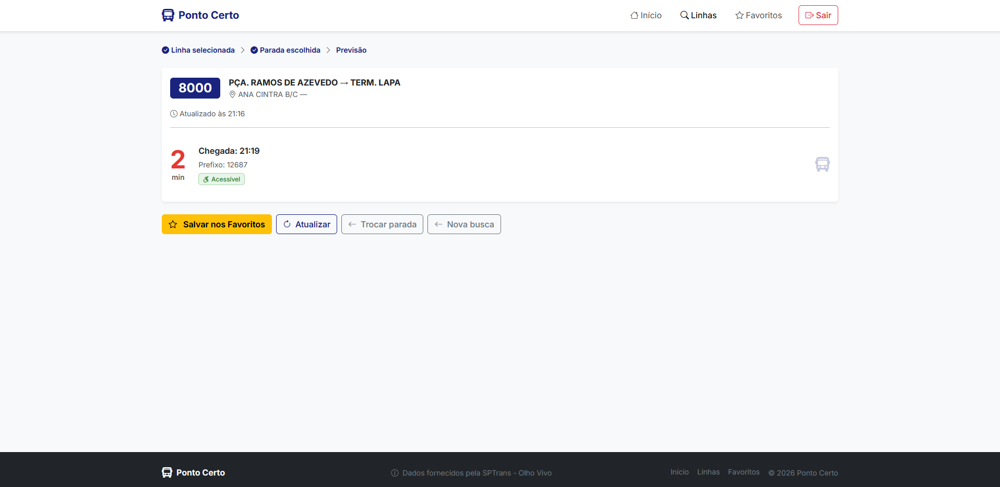
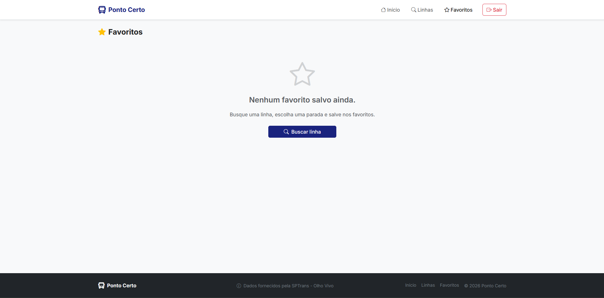
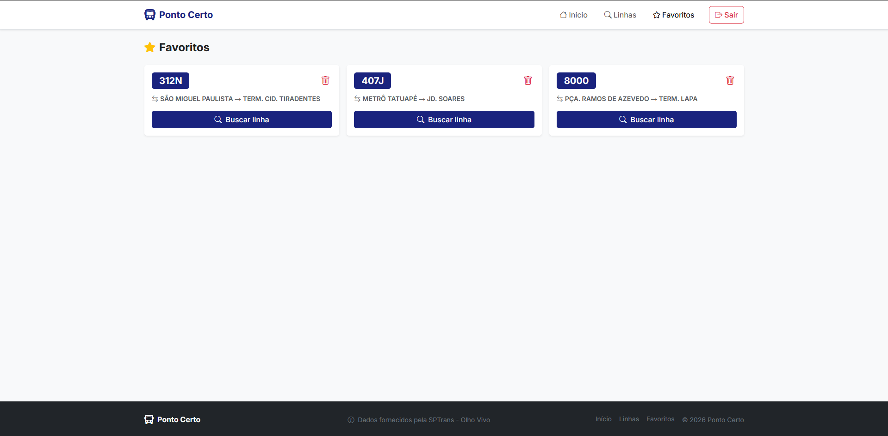

# 🚌 Ponto Certo

> Consulta de ônibus em tempo real para a cidade de São Paulo.

Ponto Certo é uma aplicação web que permite ao usuário buscar linhas de ônibus, visualizar as paradas atendidas e conferir a previsão de chegada dos veículos em tempo real, utilizando os dados abertos da API SPTrans Olho Vivo.

---

## 📸 Telas

### Tela Inicial


### Busca de Linhas


### Paradas da Linha


### Previsão de Chegada


### Favoritos



---

## 🛠️ Tecnologias

### Frontend
| Tecnologia | Versão |
|---|---|
| Angular | 17+ |
| Bootstrap | 5 |
| Bootstrap Icons | 1.11+ |
| TypeScript | 5+ |
| Node.js | 18+ |

### Backend
| Tecnologia | Versão |
|---|---|
| Java | 17+ |
| Spring Boot | 3+ |
| Spring Data JPA | — |
| MySQL | 8.0+ |
| Maven | 3.8+ |

### API Externa
- [SPTrans Olho Vivo v2.1](https://www.sptrans.com.br/desenvolvedores/)

---

## ✅ Pré-requisitos

Antes de começar, certifique-se de ter instalado:

- [Node.js 18+](https://nodejs.org/)
- [Angular CLI](https://angular.io/cli) → `npm install -g @angular/cli`
- [Java 17+](https://adoptium.net/)
- [Maven 3.8+](https://maven.apache.org/)
- [MySQL 8.0+](https://dev.mysql.com/downloads/)

---

## ⚙️ Configuração

### Banco de dados

Crie o banco de dados no MySQL:
```sql
CREATE DATABASE db_ponto_certo;
```

### Backend — `application.properties`

Edite o arquivo em `BackEnd/Ponto-Certo/Ponto-Certo/src/main/resources/application.properties`:

```properties
spring.datasource.url=jdbc:mysql://localhost:3306/db_ponto_certo?createDatabaseIfNotExist=true&serverTimezone=UTC
spring.datasource.username=root
spring.datasource.password=SUA_SENHA_AQUI

sptrans.api.token=SEU_TOKEN_SPTRANS_AQUI
```

> Para obter um token da SPTrans, cadastre-se em [sptrans.com.br/desenvolvedores](https://www.sptrans.com.br/desenvolvedores/).

---

## 🚀 Como rodar

### Backend

```bash
# Entre na pasta do backend
cd BackEnd/Ponto-Certo/Ponto-Certo

# Rode o projeto
mvn spring-boot:run
```

O servidor sobe em `http://localhost:8080`.

### Frontend

```bash
# Entre na pasta do frontend
cd frontend/ponto-certo-app

# Instale as dependências
npm install

# Rode o projeto
ng serve
```

A aplicação abre em `http://localhost:4200`.

---

## 📡 Endpoints do Backend

| Método | Endpoint | Descrição |
|---|---|---|
| `POST` | `/usuarios` | Cadastrar usuário |
| `POST` | `/usuarios/login` | Login |
| `POST` | `/linhas` | Salvar linha |
| `GET` | `/linhas/buscar-sptrans?termo=` | Buscar linhas na SPTrans |
| `GET` | `/linhas/paradas?codigoLinha=` | Buscar paradas e previsão por linha |
| `PUT` | `/usuarios/{id}/favoritar/{linhaId}` | Favoritar linha |
| `DELETE` | `/usuarios/{id}/favoritar/{linhaId}` | Remover favorito |

---

## ⚠️ Limitações conhecidas

- A API SPTrans retorna dados apenas de linhas com ônibus transmitindo GPS no momento da consulta. Linhas sem ônibus em circulação retornam sem paradas ou previsões.
- Os dados de previsão são mais completos nos horários de pico (6h–9h e 17h–20h, dias úteis).
- A autenticação com a SPTrans é feita uma vez e reutilizada. Em caso de expiração de sessão, reinicie o backend.

---

## 👥 Integrantes

Projeto Integrador — Grupo 27
Centro Universitário Senac

| Nome |
|---|
| Lucas Carlos da Silva |
| William Santiago da Silva |
| Yuri Yamada Fernandes |

---

## 📄 Licença

Este projeto foi desenvolvido para fins acadêmicos no Centro Universitário Senac.
